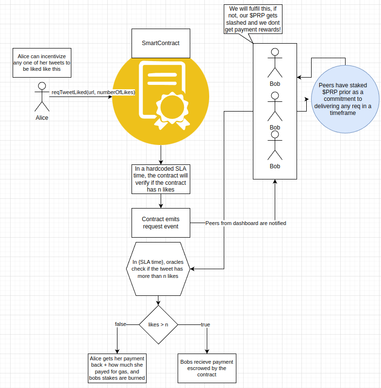

<h1>
Peer Request Protocol is a HTTP request incentivization system 🚣 
</h1>

Imagine that Alice, is a video content creator. She uploads videos to YouTube but she barely gets any views on them. She decides that she would rather have 1000 views per video she uploads rather than her usual 27 views.

Alice now has a choice, she can go the conventional route of paying the platform YouTube directly for advertising, and have the content be served to users, or, she can try out a new experimental technology, this is where PRP comes in!

Peer Request Protocol is a smart contract that allows for Requesters such as Alice, to outline an SLA to be filled. It is then the responsibility of Peers, which we will call Bob, to fulfil this contractual agreement and make it a reality.

<ul>
  <li>You want 10.000 views on a video? Peers can do that.</li>
  <li>You want to post 30 forum posts at once on a website? Peers can do that.</li>
  <li>You want content to reach a certain number of likes and shares inside of an SLA? You get the picture.</li>
</ul>

<h2>Initial plan</h2>

For a proof-of-concept goal of this technology, the goal will be having a tweet reach 10 likes via direct usage of the protocol

<h2>How the POC will be demonstrated 🤷</h2>
It will fulfill this action with the simple x step process:

<ol>
  <li>Interface, where a user submits a link to a tweet they want liked
</li>
  <li>Being userable to pay accordingly, for the smart contract to fulfil this request
</li>
  <li>Sufficient peer power and a network who's incentives matches the want to accept this job
</li>
</ol>

TO-DO: CHANGE SECTION

<!-- <h2>User interface 💻️</h2>

</img>

This UI prototype will allow any peer to fill out any request and execute this computation in a puzzle-agnostic way.

The method of incentivization of which this peer solving this puzzle will act, is by accepting a form of monetary recompense, there is no better solution to this problem than involving any cryptocurrency with low tx fees, for purposes of the POC, we have simply decided to go with fantom(FTM)

<h2>Incentivisation Mechanism 🪙</h2> -->

TO-DO: CHANGE SECTION

<!-- </img>

The POC will be marked as a success if the following things happen:
<ol>
  <li>Oracles can verify if a post was made inside of an SLA</li>
  <li>The contract can recieve the response from the oracles that the post was made</li>
  <li>The interface exists on the contract level and can be called by anyone</li>
  <li>The request computation can be payed for</li>
  <li>The output of the computation is output, and have the post verified</li>
</ol>

 -->
