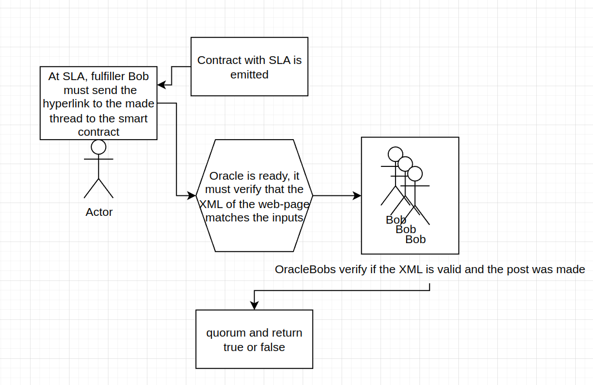

<h1>PHASE 1: THE ORACLE</h1>

<h2>THE ORACLE 🌐</h2>

We are reaching out to the team at Chainlink to discuss whether such a DON (decentralized oracle network) is able to be set-up and also fulfil this verification, whilst being cost effective. If the answer is no, we will have to build our own oracle mechanism that relies somehow on the $CAPTCHA token.

Currently reading through the Chainlink docs and this seems to be what we're looking for: 
<a href="https://docs.chain.link/any-api/introduction/">https://docs.chain.link/any-api/introduction/</a>

Here is how the oracle mechanism will work:

</img>
